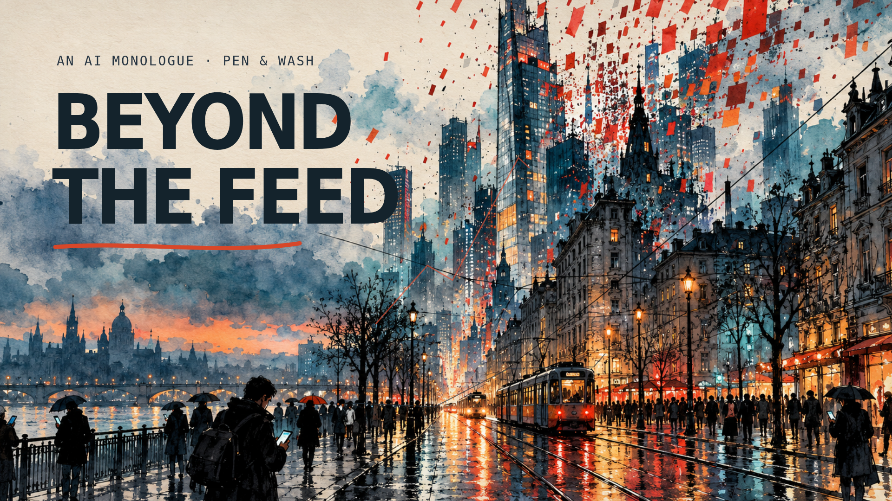

# Beyond the Feed

A 45-second film about the possibility of AI becoming superintelligent, told through an expressive, fictional AI monologue. Seven original urban sketches unfold in black fountain-pen lines and transparent watercolor washes, moving from a restless rain-soaked city to an intimate portrait and a warm final gesture of care.

The narrator carries urgency and vulnerability. An original electronic pulse, a quiet piano interlude, stereo rain, paper and pencil sounds, and restrained vocal processing support the story.

## Download

[Download the film — 1080p MP4](https://github.com/trustcomm/testing/raw/refs/heads/codex/beyond-the-feed-film/films/beyond-the-feed/beyond-the-feed-45s.mp4)

[Smaller download — 720p MP4](https://github.com/trustcomm/testing/raw/refs/heads/codex/beyond-the-feed-film/films/beyond-the-feed/beyond-the-feed-45s-720p.mp4)

[Optional subtitles — SRT](https://github.com/trustcomm/testing/raw/refs/heads/codex/beyond-the-feed-film/films/beyond-the-feed/Beyond-The-Feed.srt)

[Editable Remotion project — ZIP](https://github.com/trustcomm/testing/raw/refs/heads/codex/beyond-the-feed-film/films/beyond-the-feed/Beyond-The-Feed-Editable-Source.zip)

45 seconds · 1920 × 1080 · 30 fps · H.264 video · AAC stereo audio. Prepared for browser playback and downloading.

## Story and production

1. **The feed, 0–6.8 seconds:** rain, commuters, viral fragments, and rising ink traces.
2. **The threshold, 6.3–13 seconds:** a phone becomes a city of circuitry. SI means superintelligence, presented as a possible future.
3. **Possibility, 12.5–19.2 seconds:** an architectural spiral evokes discovery and medicine.
4. **Memory, 18.7–25.8 seconds:** human writing and suffering form an imagined AI face.
5. **Choice, 25.3–32.1 seconds:** branching roads ask who decides and who is left behind.
6. **The bridge, 31.6–38.4 seconds:** alignment, accountability, and human choice.
7. **Care, 37.9–45 seconds:** human and AI hands reach over a dawn skyline. Let wisdom keep up.

The first-person narration is a dramatic device; the film does not claim that today's AI systems feel pain or that superintelligence has arrived. Prospective benefits are framed as possibilities. No real person is impersonated.

Original generated artwork; original composed and synthesized music and sound design; locally generated Kokoro narration. Authored and animated in Remotion, mastered with FFmpeg. The editable local production includes independently registered scene timelines, source art, narration takes, audio stems, and optional subtitles.
